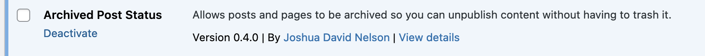

# Deactivate & Uninstall

### Deactivate the plugin


**Caution**: If you deactivate the **Archived Post Status** plugin the `archive` status will no longer exist.&#x20;

This means **all** archived content will be _inaccessibl&#x65;**.**_ The entries will still exist in the database, but it will no longer be recognized by WordPress as valid content to display.

[**Unarchive your content**](how-to-unarchive-content.md) **before deactivating the plugin.**


#### From the plugins screen

1. From the WordPress admin screen, navigate to "Plugins."
2. Locate the Archived Post Status plugin
3. Click on "Deactivate"

<figure><figcaption></figcaption></figure>

#### With WP CLI

Deactivate the plugin with wp-cli:


```bash
wp plugin deactivate archived-post-status
```


### Uninstall the plugin

#### Uninstall from the plugins screen

1. Deactivate the plugin (see above)
2. From the WordPress admin screen, navigate to "Plugins."
3. Locate the Archived Post Status plugin
4. Click on "Uninstall"

#### Uninstall with WP CLI

Uninstall the plugin with wp-cli:


```bash
wp plugin uninstall archive-post-status
```


#### Remove from Composer

Run this command:


```bash
composer remove wpackagist-plugin/archived-post-status
```

