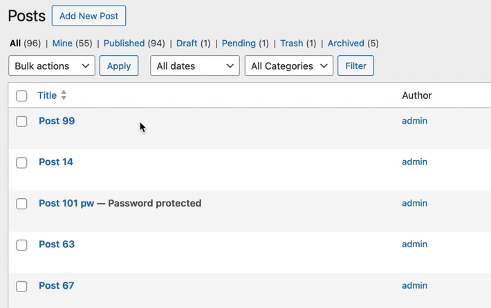
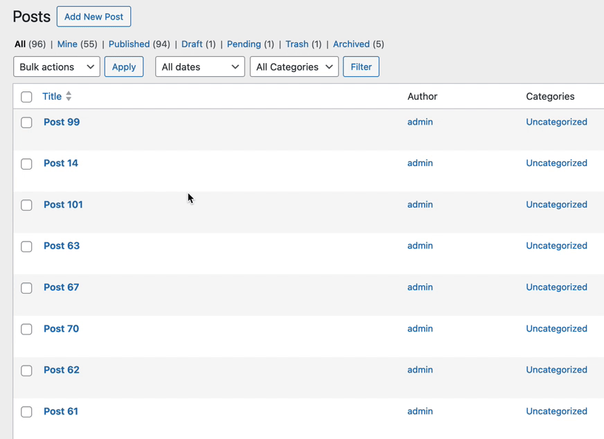
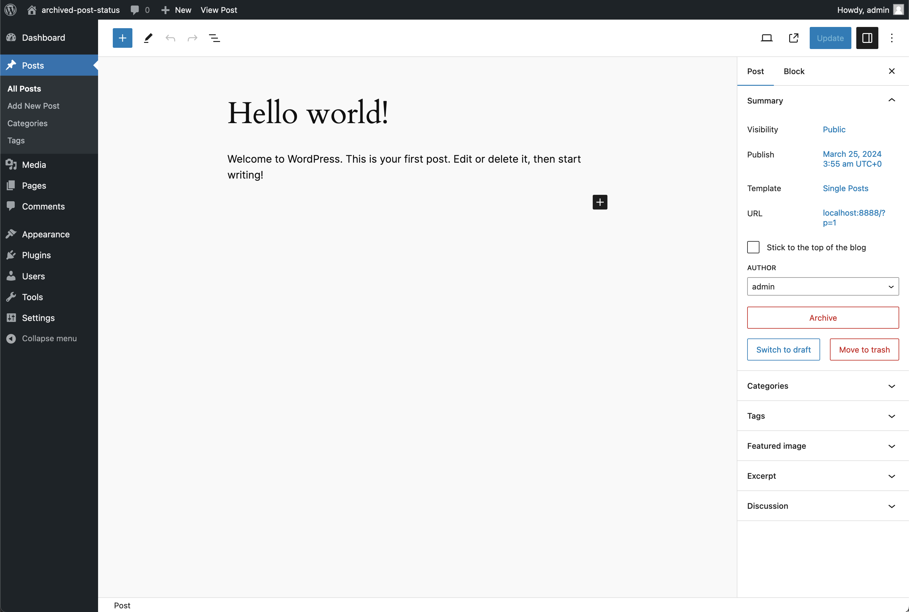
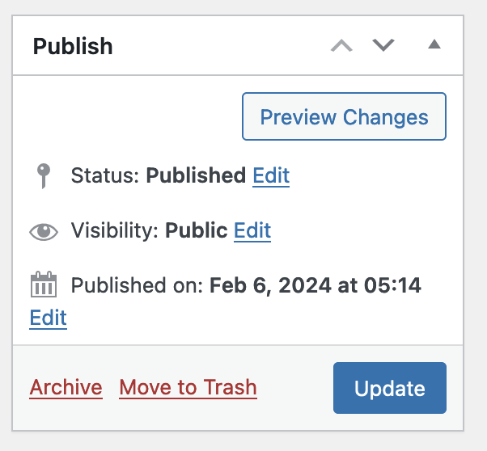

# How to Archive Content

There are a variety of ways to archive content.

### From the Posts screen

The [Posts screen](https://wordpress.org/documentation/article/posts-screen/) displays content in a table format, with each post as a row in the table.&#x20;

From this screen a user can modify each entry with Row Actions, in the Post Editor, or with Bulk Actions. See more about these actions [here](https://wordpress.com/support/edit-pages-screen/).

<figure><figcaption><p>Example: Edit Posts admin screen</p></figcaption></figure>

Archived Post Status provides options in the posts screen for core content types `post` and `page`, as well as all `public` custom post types. See [Extending the Plugin](/broken/pages/RqoQ8ehVqU9OQFdcXKkN) for how to modify this behavior.

#### Archive via Inline Action

When a user mouses over or focuses on an entry in the table, a list of links displays "inline" actions. Published entries will have an link to "Archive" the content.

1. From the Edit Screen, hover over the post's row
2. Click on the "Archive" link

<figure><figcaption><p>Archiving content with inline action</p></figcaption></figure>

If the user has the permissions to view archived content, the "View" link will also appear in the inline actions.

By default archived content is only viewable for users with the `read_private_posts` capability (Typically Editor roles and higher)

#### Bulk Archive

To Bulk Edit published content:

1. Navigate to edit screen.
2. Select the published entries to be archived.
3. From the "Bulk actions" dropdown, select "Archive."
4. Click "Apply"

<figure><figcaption><p>Bulk archive content from edit screen</p></figcaption></figure>

#### Note on Quick Edit

Prior to version 0.4.0 this plugin supported changing the post status in the "Quick Edit" via the status dropdown.&#x20;

In version 0.4.0 this functionality was replaced with the inline and bulk actions above, to better align with how WordPress core handles post-published statuses like Trash.

### In the Post Editor

#### Block Editor

1. From the block editor, navigate to the Post Settings tab.
2. Click the "Archive" button in the Summary panel.

<figure><figcaption><p>In the block editor, the archive button appears in the post settings bar, below the "Author" select field and above the "trash" button</p></figcaption></figure>

#### Classic Editor

1. Form the classic editor view.
2. Locate and click the "Publish" box, click "Archive."

<div align="center"><figure><figcaption><p>Classic editor post box</p></figcaption></figure></div>

### With a function


Always [check that a plugin function exists](https://www.php.net/manual/en/function.function-exists.php), in case the plugin is ever deactivated.


Content can be archived in a plugin or theme using the `aps_archive_post` function:


```php
aps_archive_post( int $post_id ): WP_Post|false
```


**Parameters**

`$post_id` int optional

Post ID. Default is the ID of the global `$post`&#x20;

**Return**

`WP_Post | false` Post data on success, false on failure.

**Example**


```php
if ( function_exists( 'aps_archive_post' ) ) {
    aps_archive_post( $post_id );
}
```


### With WP CLI


Be sure the plugin is active before attempting to use the commands: Activate the plugin with this command: `wp plugin activate archived-post-status`


As of version 0.4.0, CLI commands similar to `wp post delete` ([source](https://developer.wordpress.org/cli/commands/post/delete/)) are available to archive content.&#x20;


```bash
wp post archive
```


#### **Options**

**\<id>...**

**One or more IDs of posts to archive**

**\[--force]**

Only supported public post types with core non-trashed statuses can be archived. Use this flag to skip current status check.&#x20;

**\[--defer-term-counting]**

Recalculate term count in batch, for a performance boost.

**Examples**


```bash
# Archive a post
$ wp post archive 123
Success: Archived post 123.

# Archive a post without checking the current status
$ wp post archive 123 --force
Success: Archived post 123.

# Archive multiple posts
$ wp post archive 123 456 789
Success: Archived post 123.
Success: Archived post 456.
Success: Archived post 789.
```


**Note:** Archiving more than 20 posts with the CLI command will output a progress bar instead of a success message.


```sh
# Archive all pages
$ wp post archive $(wp-env run cli wp post list --post_type='page' --format=ids)
Archiving  100% ===================== 0:01 / 0:06
```

