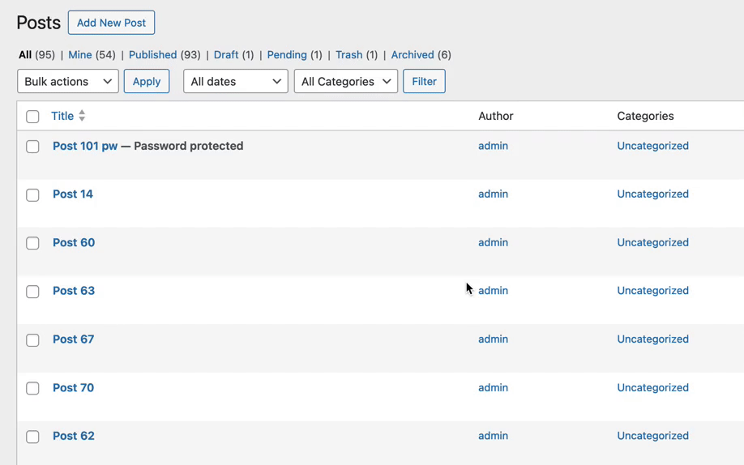
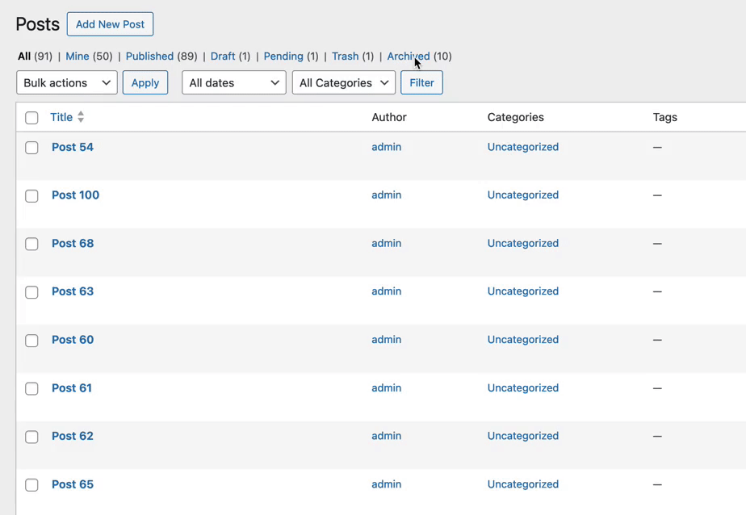

# How to Unarchive Content

See below for the ways you can remove content from the archive with the "unarchive" action.


The default behavior of any unarchive action is to restore the post to it's previous status.&#x20;

Previous statuses were added in version 0.4.0, if the content was archived prior to that version of the plugin then the previous status is not set and the content will be unarchived into `draft`status.

You can be change the this behavior with the `aps_unarchive_post_status` filter.


### From the Posts screen

The [Posts screen](https://wordpress.org/documentation/article/posts-screen/) displays content in a table format, with each post as a row in the table.&#x20;

From this screen a user can modify each entry with Row Actions, the "Quick Edit" interface, or with Bulk Actions. See more about these actions [here](https://wordpress.com/support/edit-pages-screen/).

<figure><figcaption><p>Example: Edit Posts admin screen</p></figcaption></figure>

Archived Post Status provides options in the posts screen for core content types `post` and `page`, as well as all `public` custom post types. See [Extending the Plugin](/broken/pages/RqoQ8ehVqU9OQFdcXKkN) for how to modify this behavior.

#### Unarchive with Inline Action

When a user mouses over or focuses on an entry in the table, a list of links displays "inline" actions. Archived entries will have an link to "Unarchive" the content.

1. From the Edit Screen, navigate to the "Archived" filter
2. Hover over the row for the content
3. Click on the "Unarchive" link

<figure><figcaption><p>Unarchiving content with inline action</p></figcaption></figure>

#### Bulk Unarchive

To unarchive content in bulk:

1. Navigate to the "Archived" content in the edit screen.
2. Select the archived entries to be unarchived.
3. From the "Bulk actions" dropdown, select "Unarchive."
4. Click "Apply"

<figure><figcaption><p>Unarchive content in bulk</p></figcaption></figure>

#### Note on Quick Edit

Prior to version 0.4.0 this plugin supported changing the post status in the "Quick Edit" via the status dropdown.&#x20;

In version 0.4.0 this functionality was replaced with the inline and bulk actions above, to better align with how WordPress core handles post-published statuses like Trash.

### With a Function


Always [check that a plugin function exists](https://www.php.net/manual/en/function.function-exists.php), in case it's ever deactivated!


Content can be removed from the archive, "unarchived," in a plugin or theme using the `aps_unarchive_post` function:


```php
aps_unarchive_post( int $post_id ): WP_Post|false
```


This is modeled after the WordPress core behavior for untrashing posts, however the new post status will default to the previous status with the unarchive function.

**Parameters**

`$post_id` int optional

Post ID. Default is the ID of the global `$post`&#x20;

**Return**

`WP_Post | false` Post data on success, false on failure.

**Example**


```php
if ( function_exists( 'aps_unarchive_post' ) ) {
    aps_unarchive_post( $post_id );
}
```


### With WP CLI


Be sure the plugin is active before attempting to use the commands: Activate the plugin with this command: `wp plugin activate archived-post-status`


As of version 0.4.0, CLI commands similar to `wp post delete` ([source](https://developer.wordpress.org/cli/commands/post/delete/)) are available to archive content.&#x20;


```bash
wp post unarchive
```


#### **Options**

**\<id>...**

**One or more IDs of posts to archive**

**\[--status]**

Override the new status of the post(s).

**\[--defer-term-counting]**

Recalculate term count in batch, for a performance boost.

**Examples**


```sh
# Unarchive a post
$ wp post unarchive 123
Success: Unarchived post 123.

# Unarchive a post and set a new status
$ wp post unarchive 123 --status=draft
Success: Unarchived post 123.

# Unarchive multiple posts
$ wp post unarchive 123 456 789
Success: Unarchived post 123.
Success: Unarchived post 456.
Success: Unarchived post 789.

# Unarchive all pages
$ wp post unarchive $(wp post list --post_type='page' --format=ids)
Success: Unarchived post 1234.
Success: Unarchived post 1567.
```


**Note:** Unarchiving more than 20 posts with the CLI command will output a progress bar instead of a success message:


```sh
# Unarchive all archived content
$ wp post unarchive $(wp-env run cli wp post list --post_status=archive --format=ids)
Unarchiving  100% [=====================] 0:01 / 0:06
```


### Unarchiving content without the plugin


If you deactivate/uninstall the **Archived Post Status** plugin the `archive` status will no longer exist.&#x20;

This means any archived content will become _inaccessibl&#x65;**.**_ The entries will still exist in the database, but they will no longer be recognized by WordPress as valid content to display.

It's best to reinstall & reactivate Archived Post Status, unarchive via the methods above, and then proceed to [remove the plugin](deactivate-and-uninstall.md).&#x20;

However, if you've removed the plugin or cannot use it, here are some ways to update the status of your archived content without the plugin.


#### With WP-CLI


Use caution when running these commands on your production site. It's always a good idea to _test_ first in a safe environment like a staging site.

Always backup your site and database prior to making bulk changes.


Here's a single command that retrieves all posts with a post status of "archive" across all _public_ post types and then changes their status to _draft_:


```bash
wp post update $(wp post list --post_type=$(wp post-type list --field=name --format=csv | grep -E "1$" | tr '\n' ',' | sed 's/,$//') --post_status=archive --field=ID) --post_status=draft
```


Explanation:

* `wp post-type list --field=name --format=csv | grep -E "1$" | tr '\n' ',' | sed 's/,$//'`: This part of the command retrieves the names of all public post types by filtering the output of `wp post-type list` to include only post types where the 'public' field is set to 1. It then formats the output as comma-separated values (CSV).
* `wp post list --post_type=... --post_status=archive --field=ID`: This command lists all posts with post status "archive" and post types obtained from the previous command. It retrieves only the IDs of these posts.
* `wp post update ... --post_status=draft`: This part of the command updates the status of the retrieved posts to "draft". Change "draft" to another status as needed.

This command will effectively change the post status to "draft" for all posts with the "archive" status across all public post types.

**Note:** There are limits to the number of arguments you can pass to the `wp post update` command, so if you have _a lot_ of archived content this command might not work.&#x20;
