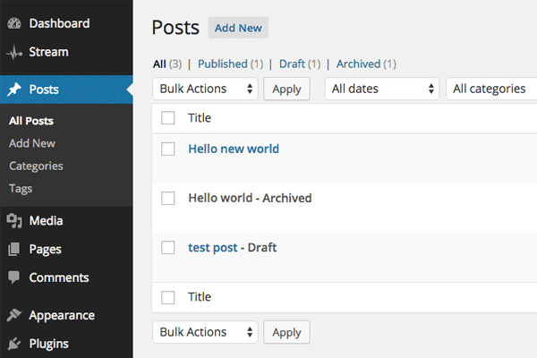
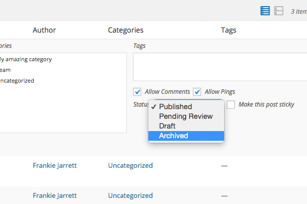
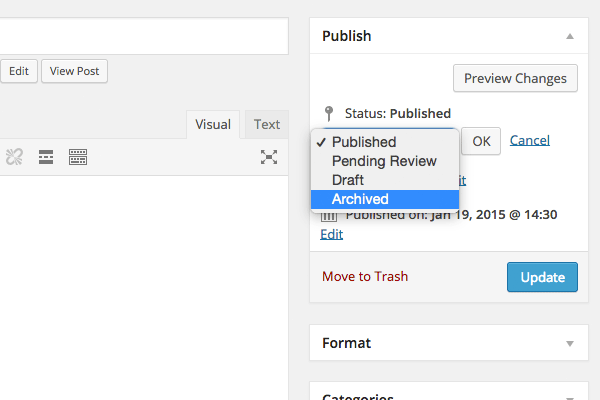

<!-- DO NOT EDIT THIS FILE; it is auto-generated from readme.txt -->
# Archived Post Status


[](https://wordpress.org/plugins/archived-post-status/)  

Allows posts and pages to be archived so you can unpublish content without having to trash it.

**Contributors:** [joshuadavidnelson](https://github.com/joshuadavidnelson), [fjarrett](https://profiles.wordpress.org/fjarrett)  
**Tags:** [admin](https://wordpress.org/plugins/tags/admin), [posts](https://wordpress.org/plugins/tags/posts), [pages](https://wordpress.org/plugins/tags/pages), [status](https://wordpress.org/plugins/tags/status), [workflow](https://wordpress.org/plugins/tags/workflow)  
**Requires at least:** 5.3  
**Tested up to:** 6.4.2  
**Stable tag:** 0.3.8  
**License:** [GPL-2.0](https://www.gnu.org/licenses/gpl-2.0.html)  

## Description

**Did you find this plugin helpful? Please consider [leaving a 5-star review](https://wordpress.org/support/view/plugin-reviews/archived-post-status).**

This plugin allows you to archive your WordPress content similar to the way you archive your e-mail.

* Makes a new post status available in the dropdown called Archived
* Unpublish your posts and pages without having to trash them
* Compatible with posts, pages and custom post types
* Ideal for sites where certain kinds of content is not meant to be evergreen

**Languages supported:**

* English
* Čeština
* Deutsch
* Español
* Français
* Nederlands
* Português
* Русский

**Development of this plugin is done [on GitHub](https://github.com/fjarrett/archived-post-status). Pull requests welcome. Please see [issues reported](https://github.com/fjarrett/archived-post-status/issues) there before going to the plugin forum.**

## Frequently Asked Questions

## Isn't this the same as using the Draft or Private statuses?

Actually, no, they are not the same thing.

The Draft status is a "pre-published" status that is reserved for content that is still being worked on. You can still make changes to content marked as Draft, and you can preview your changes.

The Private status is a special kind of published status. It means the content is published, but only certain logged-in users can view it.

The Archived post status, on the other hand, is meant to be a "post-published" status. Once a post has been set to Archived it can no longer be edited or viewed.

Of course, you can always change the status back to Draft or Publish if you want to be able to edit its content again.

## Can't I just trash old content I don't want anymore?

Yes, there is nothing wong with trashing old content. And the behavior of the Archived status is very similar to that of trashing.

However, WordPress automatically purges trashed posts every 7 days (by [default]()).

This is what makes the Archived post status handy. You can unpublish content without having to delete it forever.

### Where are the options for this plugin?

This plugin does not have a settings page. However, there are numerous hooks available in the plugin so you can customize default behaviors. Many of those hooks are listed below in this FAQ

### Why are Archived posts appearing on the front-end?
This is most likely because you are viewing your site while being logged in as an Editor or Administrator.

By default, any user with the [`read_private_posts`](http://codex.wordpress.org/Roles_and_Capabilities#read_private_posts) capability will see Archived posts appear on the front-end of your site.

You can change the default read capability by adding this hook to your theme's `functions.php` file or as an [MU plugin](http://codex.wordpress.org/Must_Use_Plugins):

```php
function my_aps_default_read_capability( $capability ) {
	$capability = 'read';

	return $capability;
}
add_filter( 'aps_default_read_capability', 'my_aps_default_read_capability' );
```

### Can I make Archived posts appear on the front-end for all users?
Yes, simply add these hooks to your theme's `functions.php` file or as an [MU plugin](http://codex.wordpress.org/Must_Use_Plugins):

```php
add_filter( 'aps_status_arg_public', '__return_true' );
add_filter( 'aps_status_arg_private', '__return_false' );
add_filter( 'aps_status_arg_exclude_from_search', '__return_false' );
```

### Can I make Archived posts hidden from the "All" list in the WP Admin, similar to Trashed posts?
Yes, simply add these hooks to your theme's `functions.php` file or as an [MU plugin](http://codex.wordpress.org/Must_Use_Plugins):

```php
add_filter( 'aps_status_arg_public', '__return_false' );
add_filter( 'aps_status_arg_private', '__return_false' );
add_filter( 'aps_status_arg_show_in_admin_all_list', '__return_false' );
```

Please note that there is a [bug in core](https://core.trac.wordpress.org/ticket/24415) that requires public and private to be set to false in order for the `aps_status_arg_show_in_admin_all_list` to also be false. There are many bugs in core surrounding registering custom post statuses, so if something doesn't work the way you want on the first try be prepared to do some digging through trac :-)

### Can I exclude the Archived status from appearing on certain post types?
Yes, simply add this hook to your theme's `functions.php` file or as an [MU plugin](http://codex.wordpress.org/Must_Use_Plugins):

```php
function my_aps_excluded_post_types( $post_types ) {
	$post_types[] = 'my_custom_post_type';

	return $post_types;
}
add_filter( 'aps_excluded_post_types', 'my_aps_excluded_post_types' );
```


## Screenshots

### Post list table screen.



### Quick Edit mode.



### Publish metabox controls.



## Contributing

All contributions are welcomed and considered, please refer to [contributing.md](contributing.md).

### Pull requests
All pull requests should be directed at the `develop` branch, and will be reviewed prior to merging. No pull requests will be merged with failing tests, but it's okay if you don't initially pass tests. Please create a draft pull request for proof of concept code or changes you'd like to have input on prior to review.

Please make on a branch specific to a single issue or feature. For instance, if you are suggest a solution to an issue, please create fork with a branch like `issue-894`. Or if you are proposing a new feature, create a fork with the branch name indicating the feature like `feature-example-bananas`

All improvements are merged into `develop` and then queued up for release before being merged into `stable`. Releases are deployed via github actions to wordpress.org on tagging a new release.

### Main Branches

The `stable` branch is reserved for releases and intended to be a mirror of the official current release, or `trunk` on wordpress.org.

The `develop` branch is the most current working branch. _Please direct all pull requests to the `develop` branch_

### Local Development

**Requirements:**
- Docker
- Node Package Manager (npm)

This repo contains the files needed to boot up a local development environment using [wp-env](https://developer.wordpress.org/block-editor/reference-guides/packages/packages-env/).

Run `npm install` and the `npm run env:start` to boot up a local environment. 
