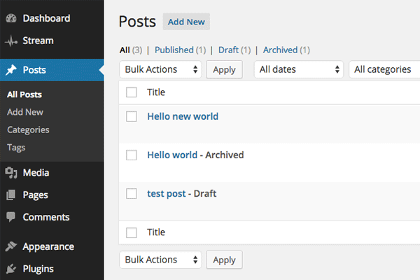
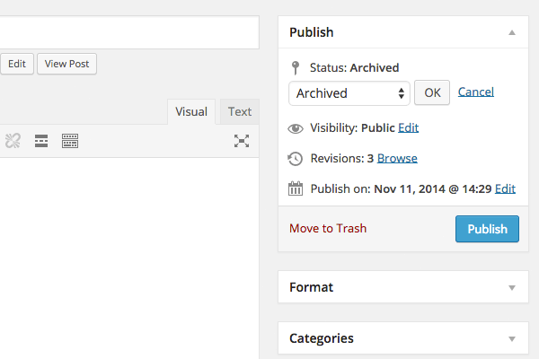

<!-- DO NOT EDIT THIS FILE; it is auto-generated from readme.txt -->
# Archived Post Status

Allows posts and pages to be archived so you can unpublish content without having to trash it.

**Contributors:** [fjarrett](http://profiles.wordpress.org/fjarrett)  
**Tags:** [admin](http://wordpress.org/plugins/tags/admin), [posts](http://wordpress.org/plugins/tags/posts), [pages](http://wordpress.org/plugins/tags/pages), [status](http://wordpress.org/plugins/tags/status), [workflow](http://wordpress.org/plugins/tags/workflow)  
**Requires at least:** 3.0  
**Tested up to:** 4.1  
**Stable tag:** trunk (master)  
**License:** [GPLv2 or later](http://www.gnu.org/licenses/gpl-2.0.html)  

 

## Description ##

**Did you find this plugin helpful? Please consider [writing a review](https://wordpress.org/support/view/plugin-reviews/archived-post-status).**

This plugin allows you to archive your WordPress content similar to the way you archive your e-mail.

* Makes a new post status available in the dropdown called Archived
* Unpublish your posts and pages without having to trash them
* Compatible with posts, pages and custom post types
* Ideal for sites where certain kinds of content is not meant to be evergreen

**Development of this plugin is done [on GitHub](https://github.com/fjarrett/archived-post-status). Pull requests welcome. Please see [issues reported](https://github.com/fjarrett/archived-post-status/issues) there before going to the plugin forum.**

## Frequently Asked Questions ##

### Can I exclude the Archived status from appearing on certain post types? ###
Yes, you can do this by using the `aps_excluded_post_types` filter:

<pre lang="php">
function my_aps_excluded_post_types( $post_types ) {
	$post_types[] = 'my_custom_post_type';

	return $post_types;
}
add_filter( 'aps_excluded_post_types', 'my_aps_excluded_post_types', 10, 1 );
</pre>

## Screenshots ##

### Post list table screen

### Quick Edit mode

### Publish metabox controls

## Changelog ##

### 0.1.0 - January 4, 2015 ###
* Initial release

Props [fjarrett](https://profiles.wordpress.org/fjarrett/)

